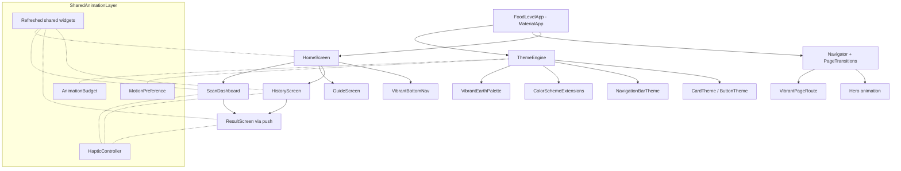
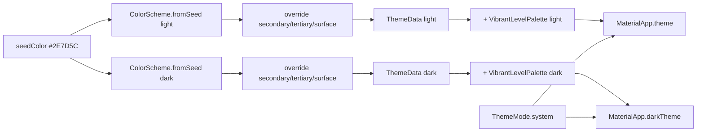
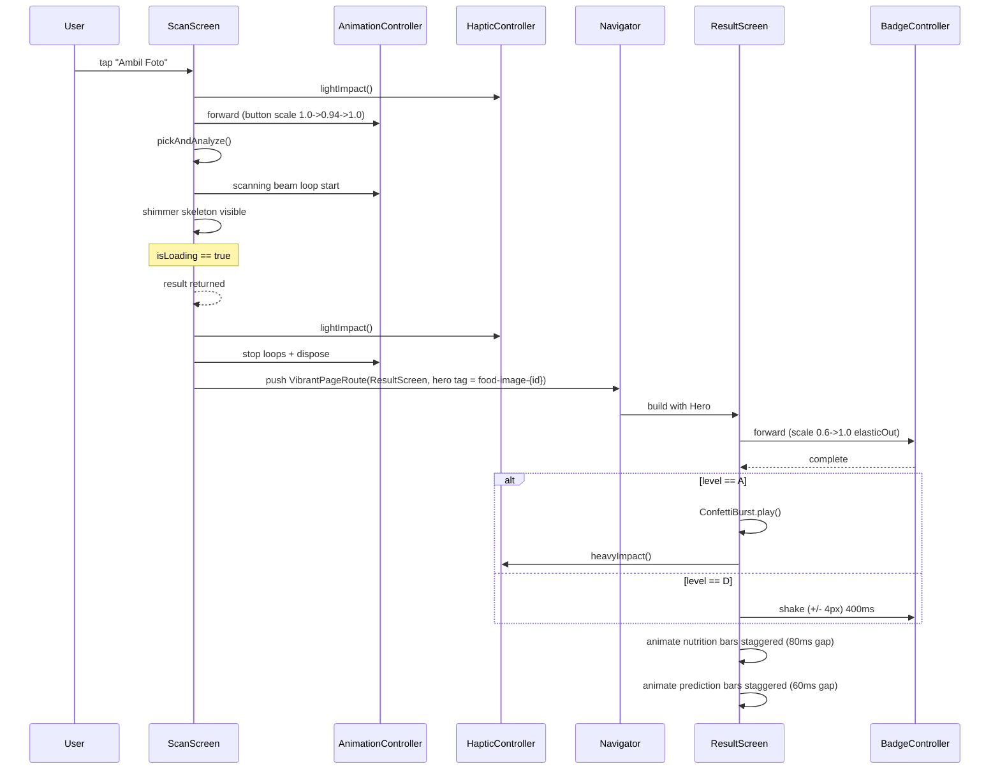

# Design Document — UI Vibrant Refresh

## Overview

UI Vibrant Refresh adalah lapisan polish UI di atas arsitektur FoodLevel yang sudah ada. Refresh ini fokus ke dua hal:

1. **Color system overhaul** — pindah dari palet hijau-netral lama ke tema **Vibrant Earth / Healthy Glow** (Matcha Green primary, Terracotta Orange accent, Mustard Yellow tertiary, Cream Beige surface, Deep Charcoal text). Semua warna dialamatkan lewat `ThemeData` + `ColorScheme` extension supaya call-site tidak perlu hardcoded.
2. **Animation & microinteraction layer** — scanning beam, shimmer skeleton, hero transition gambar, animated nutrition bars, badge reveal + glow + shake/confetti, custom bottom nav, swipe-to-delete, page transition, dan haptic feedback. Semuanya tunduk pada `AnimationBudget` standar dan `MotionPreference` toggle.

Yang **tidak** disentuh:

- Riverpod controllers (`ScanController`, `HistoryController`).
- Domain models (`AnalysisRecord`, `NutritionItem`, `NutritionLevel`, `FoodPrediction`).
- Repository layer (`NutritionRepository`, `PredictionRepository`, `HistoryRepository`).
- Routing strategy (tetap pakai `Navigator.push` + `MaterialPageRoute`, di-extend lewat custom `PageRouteBuilder`).

Karena scope-nya UI-only, semua perubahan terjadi di tiga area:

- `lib/core/theme/` — theme engine, palette, animation budget, motion preference.
- `lib/shared/widgets/` — refresh widget yang sudah ada + tambah widget animasi baru.
- `lib/features/<feature>/presentation/` — ganti hardcoded color, bungkus widget animasi baru, panggil haptic util.

### Design Principles

- **Theme-driven first**: tidak ada `Color(0xFF...)` di luar `lib/core/theme/`. Komponen membaca dari `Theme.of(context).colorScheme` atau `context.vibrantPalette` (extension).
- **Public API stability**: 5 widget shared (`AnimatedEntry`, `PulseIconButton`, `SectionCard`, `SoftChip`, `FoodLevelBadge`) wajib mempertahankan constructor signature. Implementasi internal boleh berubah.
- **Reduced motion is first-class**: setiap animasi non-esensial cek `MotionPreference` dari awal, bukan ditambahin di akhir sebagai patch.
- **Animation budget**: durasi animasi ambil dari konstanta `AnimationBudget`, bukan magic number per call-site.
- **Performance defensive**: loop animation dipasangkan `RepaintBoundary`, controller di-`dispose` di `State.dispose`, lifecycle aware dengan `WidgetsBindingObserver` untuk pause saat app di-background.

### Out of Scope

- Migrasi ke `go_router` (tetap simple `Navigator`).
- Custom font family (tetap default Material 3, bisa di-iterate kemudian).
- Localization framework (`intl` sudah ada, tapi copy ditulis hardcoded ID dulu).
- TFLite / on-device inference (tetap mock).

---

## Architecture

### High-Level Layering



### Module Map

| Path | Purpose | Status |
|---|---|---|
| `lib/core/theme/app_theme.dart` | Build `ThemeData` light + dark | **Refactor** |
| `lib/core/theme/vibrant_palette.dart` | Brand colors + level colors + `ThemeExtension` | **New** |
| `lib/core/theme/animation_budget.dart` | Standard durations + curves | **New** |
| `lib/core/theme/motion_preference.dart` | `MediaQuery.disableAnimations` reader + helper | **New** |
| `lib/core/utils/haptic_controller.dart` | Cross-platform haptic wrapper | **New** |
| `lib/app/transitions/vibrant_page_route.dart` | Custom `PageRouteBuilder` | **New** |
| `lib/shared/widgets/animated_entry.dart` | Slide-up entry | **Refresh** (motion-aware) |
| `lib/shared/widgets/pulse_icon_button.dart` | Pulse + scale-on-tap | **Refresh** (motion-aware + haptic) |
| `lib/shared/widgets/section_card.dart` | Card wrapper | **Refresh** (theme-aware shadows) |
| `lib/shared/widgets/soft_chip.dart` | Soft-tinted chip | **Refresh** (palette fallback) |
| `lib/shared/widgets/scanning_beam.dart` | Vertical scanning overlay | **New** |
| `lib/shared/widgets/shimmer_skeleton.dart` | Shimmer loading placeholder | **New** |
| `lib/shared/widgets/animated_nutrition_bar.dart` | Tween-driven nutrient bar | **New** |
| `lib/shared/widgets/vibrant_bottom_nav.dart` | Spring indicator nav | **New** |
| `lib/shared/widgets/swipe_to_delete_tile.dart` | Dismissible wrapper with custom bg | **New** |
| `lib/shared/widgets/confetti_burst.dart` | Confetti wrapper for level A | **New** |
| `lib/shared/widgets/empty_state_illustration.dart` | Lottie/implicit illustration | **New** |
| `lib/features/result/presentation/widgets/food_level_badge.dart` | Level badge | **Refresh** (palette + reveal animation) |
| `lib/features/result/presentation/widgets/prediction_confidence_list.dart` | Confidence bars | **Refresh** (staggered tween) |
| `lib/features/result/presentation/widgets/nutrition_metric_tile.dart` | Metric tile | **Refresh** (shared `AnimatedNutritionBar` integration) |
| `lib/features/home/presentation/home_screen.dart` | Home + bottom nav | **Refresh** (use `VibrantBottomNav`) |
| `lib/features/scan/presentation/scan_screen.dart` *(if extracted)* | Scan flow with beam + shimmer | **Refresh** |
| `lib/features/result/presentation/result_screen.dart` | Result with hero + confetti | **Refresh** |
| `lib/features/history/presentation/history_screen.dart` | History with swipe-to-delete | **Refresh** |
| `lib/features/guide/presentation/nutri_level_guide_screen.dart` | Guide with refreshed badges | **Refresh** |

### Theme Architecture

Theme dibangun lewat `ColorScheme.fromSeed` lalu di-override pada slot `secondary`, `tertiary`, dan `surface`. Palet level (A/B/C/D) dipasang sebagai **`ThemeExtension<VibrantLevelPalette>`** supaya bisa diakses lewat `Theme.of(context).extension<VibrantLevelPalette>()` dan otomatis ikut light/dark switch.



### Animation Architecture

Tiap layar mengikuti pola yang sama:

1. Layar mendeklarasikan `AnimationController` per animasi yang state-nya hidup di widget itu (badge reveal, scanning beam, shimmer).
2. Durasi diambil dari `AnimationBudget` (`fast`, `base`, `slow`, `hero`).
3. `MotionPreference.disableAnimations(context)` dicek pada `build()` — kalau `true`, controller tidak distart, animation dilewat dan target value dipakai langsung.
4. Pada `dispose()`, semua controller di-dispose.
5. Untuk loop animation, `WidgetsBindingObserver` digabung ke state, `didChangeAppLifecycleState` mem-`stop()` controller saat `paused` dan `repeat()` saat `resumed`.



---

## Components and Interfaces

### 1. ThemeEngine (`lib/core/theme/`)

#### `vibrant_palette.dart`

```dart
/// Brand-level constants. Tidak boleh dipakai langsung dari widget;
/// dipakai oleh ThemeEngine untuk membangun ColorScheme + extension.
abstract final class VibrantBrand {
  static const matchaGreen      = Color(0xFF2E7D5C); // primary seed
  static const terracottaOrange = Color(0xFFE76F51); // secondary light
  static const mustardYellow    = Color(0xFFF4A261); // tertiary light
  static const creamBeige       = Color(0xFFFFF8EC); // surface light
  static const deepCharcoal     = Color(0xFF2D3142); // onSurface light

  static const darkSurface      = Color(0xFF1A1C22);
  static const darkSecondary    = Color(0xFFFF8C42);
  static const darkTertiary     = Color(0xFFFFB627);
}

@immutable
class VibrantLevelPalette extends ThemeExtension<VibrantLevelPalette> {
  const VibrantLevelPalette({
    required this.levelA,
    required this.levelB,
    required this.levelC,
    required this.levelD,
    required this.onLevelA,
    required this.onLevelB,
    required this.onLevelC,
    required this.onLevelD,
  });

  final Color levelA, levelB, levelC, levelD;
  final Color onLevelA, onLevelB, onLevelC, onLevelD;

  Color colorOf(NutritionLevel level) => switch (level) {
        NutritionLevel.a => levelA,
        NutritionLevel.b => levelB,
        NutritionLevel.c => levelC,
        NutritionLevel.d => levelD,
      };

  Color onColorOf(NutritionLevel level) => switch (level) {
        NutritionLevel.a => onLevelA,
        NutritionLevel.b => onLevelB,
        NutritionLevel.c => onLevelC,
        NutritionLevel.d => onLevelD,
      };

  @override VibrantLevelPalette copyWith({...}) => ...;
  @override VibrantLevelPalette lerp(other, t) => ...;

  static const light = VibrantLevelPalette(
    levelA:   Color(0xFF4CAF50),
    levelB:   Color(0xFFA8C957),
    levelC:   Color(0xFFF4A261),
    levelD:   Color(0xFFE76F51),
    onLevelA: Colors.white,
    onLevelB: VibrantBrand.deepCharcoal,
    onLevelC: VibrantBrand.deepCharcoal,
    onLevelD: Colors.white,
  );

  static const dark = VibrantLevelPalette(
    levelA:   Color(0xFF66BB6A),
    levelB:   Color(0xFFC5DB7E),
    levelC:   Color(0xFFFFB867),
    levelD:   Color(0xFFFF8A65),
    onLevelA: Color(0xFF0F1610),
    onLevelB: Color(0xFF0F1610),
    onLevelC: Color(0xFF1A1306),
    onLevelD: Color(0xFF1B0E0A),
  );
}

extension VibrantPaletteContext on BuildContext {
  VibrantLevelPalette get vibrantPalette =>
      Theme.of(this).extension<VibrantLevelPalette>()!;
}
```

**Kontras** untuk pasangan `levelX`/`onLevelX` divalidasi minimal 4.5:1 baik di light maupun dark (Requirement 3.3, 3.4, 13.6). Pemilihan `onLevelB` dan `onLevelC` ke `deepCharcoal` di light (alih-alih putih) dilakukan supaya rasio kontras lulus pada hijau muda dan oranye.

#### `app_theme.dart` (refactored)

```dart
class AppTheme {
  static ThemeData light() {
    final scheme = ColorScheme.fromSeed(
      seedColor: VibrantBrand.matchaGreen,
      brightness: Brightness.light,
    ).copyWith(
      secondary: VibrantBrand.terracottaOrange,
      tertiary: VibrantBrand.mustardYellow,
      surface: VibrantBrand.creamBeige,
      onSurface: VibrantBrand.deepCharcoal,
    );

    return _baseTheme(scheme).copyWith(
      scaffoldBackgroundColor: VibrantBrand.creamBeige,
      extensions: const [VibrantLevelPalette.light],
    );
  }

  static ThemeData dark() {
    final scheme = ColorScheme.fromSeed(
      seedColor: VibrantBrand.matchaGreen,
      brightness: Brightness.dark,
    ).copyWith(
      secondary: VibrantBrand.darkSecondary,
      tertiary: VibrantBrand.darkTertiary,
      surface: VibrantBrand.darkSurface,
    );

    return _baseTheme(scheme).copyWith(
      scaffoldBackgroundColor: VibrantBrand.darkSurface,
      extensions: const [VibrantLevelPalette.dark],
    );
  }

  static ThemeData _baseTheme(ColorScheme scheme) {
    return ThemeData(
      useMaterial3: true,
      colorScheme: scheme,
      appBarTheme: AppBarTheme(
        backgroundColor: scheme.surface,
        foregroundColor: scheme.onSurface,
        centerTitle: false,
        elevation: 0,
        scrolledUnderElevation: 0,
      ),
      cardTheme: CardThemeData(
        elevation: 0,
        color: scheme.surfaceContainerLow,
        shape: RoundedRectangleBorder(borderRadius: BorderRadius.circular(16)),
      ),
      navigationBarTheme: NavigationBarThemeData(
        backgroundColor: scheme.surface,
        indicatorColor: scheme.primary.withValues(alpha: 0.16),
        labelTextStyle: WidgetStateProperty.resolveWith(_navLabelStyle),
      ),
      filledButtonTheme: FilledButtonThemeData(
        style: FilledButton.styleFrom(
          minimumSize: const Size.fromHeight(52),
          shape: RoundedRectangleBorder(borderRadius: BorderRadius.circular(14)),
        ),
      ),
      outlinedButtonTheme: OutlinedButtonThemeData(
        style: OutlinedButton.styleFrom(
          minimumSize: const Size.fromHeight(52),
          shape: RoundedRectangleBorder(borderRadius: BorderRadius.circular(14)),
        ),
      ),
    );
  }
}
```

`MaterialApp` di `app/app.dart` di-update jadi:

```dart
return MaterialApp(
  title: 'FoodLevel',
  themeMode: ThemeMode.system, // Req 2.6
  theme: AppTheme.light(),
  darkTheme: AppTheme.dark(),
  home: const HomeScreen(),
);
```

#### `animation_budget.dart`

```dart
abstract final class AnimationBudget {
  static const fast = Duration(milliseconds: 150);
  static const base = Duration(milliseconds: 300);
  static const slow = Duration(milliseconds: 500);
  static const hero = Duration(milliseconds: 450);

  // Specific named durations for cross-screen consistency
  static const beamLoop = Duration(milliseconds: 1500);
  static const shimmerLoop = Duration(milliseconds: 1200);
  static const nutritionBar = Duration(milliseconds: 800);
  static const badgeReveal = Duration(milliseconds: 600);
  static const badgeGlow = Duration(milliseconds: 1200);
  static const badgeShake = Duration(milliseconds: 400);
  static const confetti = Duration(milliseconds: 1500);
  static const swipeCollapse = Duration(milliseconds: 300);
  static const counterTween = Duration(milliseconds: 400);
  static const reducedMotionFade = Duration(milliseconds: 200);

  static const Curve standardCurve = Curves.easeOutCubic;
  static const Curve revealCurve = Curves.elasticOut;
  static const Curve bounceCurve = Curves.easeOutBack;
}
```

#### `motion_preference.dart`

```dart
abstract final class MotionPreference {
  static bool disabled(BuildContext context) =>
      MediaQuery.maybeOf(context)?.disableAnimations ?? false;

  /// Helper: kalau motion off, durasi diganti `Duration.zero`.
  static Duration scaled(BuildContext context, Duration full) =>
      disabled(context) ? Duration.zero : full;

  /// Helper: jalankan callback hanya kalau motion aktif.
  static void runIfMotion(BuildContext context, VoidCallback fn) {
    if (!disabled(context)) fn();
  }
}
```

### 2. HapticController (`lib/core/utils/haptic_controller.dart`)

Wrapper supaya call-site tidak perlu `if (kIsWeb)` di mana-mana (Requirement 11.4, 11.5).

```dart
abstract final class HapticController {
  static bool get _enabled =>
      !kIsWeb && (Platform.isAndroid || Platform.isIOS);

  static Future<void> light()      => _enabled ? HapticFeedback.lightImpact()    : Future.value();
  static Future<void> medium()     => _enabled ? HapticFeedback.mediumImpact()   : Future.value();
  static Future<void> heavy()      => _enabled ? HapticFeedback.heavyImpact()    : Future.value();
  static Future<void> selection()  => _enabled ? HapticFeedback.selectionClick() : Future.value();
}
```

Note: di test environment juga tidak akan crash karena `Platform.isAndroid` di host non-mobile akan `false`.

### 3. PageTransition (`lib/app/transitions/vibrant_page_route.dart`)

```dart
class VibrantPageRoute<T> extends PageRouteBuilder<T> {
  VibrantPageRoute({required WidgetBuilder builder})
      : super(
          transitionDuration: AnimationBudget.base.inMilliseconds == 300
              ? const Duration(milliseconds: 320)
              : AnimationBudget.base,
          reverseTransitionDuration: const Duration(milliseconds: 240),
          pageBuilder: (ctx, _, _) => builder(ctx),
          transitionsBuilder: (ctx, anim, _, child) {
            final reduced = MotionPreference.disabled(ctx);
            if (reduced) {
              return FadeTransition(
                opacity: CurvedAnimation(
                  parent: anim,
                  curve: Curves.easeOut,
                ),
                child: child,
              );
            }
            final slide = Tween<Offset>(
              begin: const Offset(0, 0.06),
              end: Offset.zero,
            ).chain(CurveTween(curve: Curves.easeOutCubic));
            return FadeTransition(
              opacity: CurvedAnimation(parent: anim, curve: Curves.easeOutCubic),
              child: SlideTransition(position: anim.drive(slide), child: child),
            );
          },
        );
}
```

Reverse curve `Curves.easeInCubic` (Req 8.3) di-handle Flutter secara default karena `transitionsBuilder` menerima `animation` yang sudah di-reverse saat pop. Kita expose `secondaryAnimation` curve hanya bila perlu fade-out kontras pada layar yang ditinggalkan.

### 4. Refreshed Shared Widgets

#### `AnimatedEntry` (refresh)

- **Public API**: tetap `AnimatedEntry({required child, delay, offset, key})`.
- **Perubahan**: `MotionPreference.disabled(context)` dicek; kalau `true`, langsung return `child` apa adanya. Kalau aktif, behavior lama tetap (fade + translate-up).

#### `PulseIconButton` (refresh)

- **Public API**: tetap.
- **Perubahan**:
  - Pulse loop hanya dimulai kalau `MotionPreference.disabled(context) == false`.
  - On-tap, panggil `HapticController.medium()` (Req 4.4) lalu jalankan tap-scale 1.0 → 0.94 → 1.0 selama `AnimationBudget.fast` (Req 4.3).
  - Warna FilledButton ikut `colorScheme.primary` (sudah by default).

#### `SectionCard` (refresh)

- **Public API**: tetap.
- **Perubahan**: tambahkan optional `borderRadius` & `tone` (default tone = `surfaceContainerLow`). Memakai `Theme.of(context).cardTheme` dulu sebagai sumber radius/elevation.

#### `SoftChip` (refresh)

- **Public API**: tetap (`label`, `icon`, `color`).
- **Perubahan**: Kalau `color == null`, fallback ke `Theme.of(context).colorScheme.primary` (Req 12.3).
- Alpha tetap 0.12.

#### `FoodLevelBadge` (refresh + extend)

- **Public API**: tambah optional named param non-breaking:
  ```dart
  const FoodLevelBadge({
    required this.level,
    this.size = 56,
    this.animateReveal = true,
    this.glowOnReveal = true,
    super.key,
  });
  ```
- **Perubahan**:
  - Warna dari `context.vibrantPalette.colorOf(level)` (Req 3.2, 12.5).
  - Reveal animation: scale 0.6 → 1.0 elasticOut, durasi `AnimationBudget.badgeReveal` (Req 6.3).
  - Glow ring: stack `Container` dengan `BoxShadow` di-tween opacity 0 → 0.4 → 0 selama `AnimationBudget.badgeGlow` (Req 6.3).
  - Shake horizontal ±4px untuk level D (Req 6.4): `Tween<double>(begin: -4, end: 4)` + sequence reverse, `AnimationBudget.badgeShake`.
  - Kalau `MotionPreference.disabled(context)`: skip reveal/glow/shake, langsung render badge final.

### 5. New Widgets

#### `ScanningBeam`

```dart
class ScanningBeam extends StatefulWidget {
  const ScanningBeam({
    required this.active,
    this.color,
    super.key,
  });
  final bool active;
  final Color? color;
}
```

- Implementasi: `AnimationController(duration: AnimationBudget.beamLoop)`.
- Loop `..repeat()` saat `active && !reduced`.
- `Stack` di atas preview gambar; `Positioned` dengan `top` di-tween 0 → fullHeight memakai `LinearGradient` overlay (transparent → primaryAlpha20 → transparent).
- Wajib di-bungkus `RepaintBoundary` di luar (Req 14.5 untuk shimmer; pola yang sama dipakai juga untuk beam).
- Dispose controller dengan `_controller.dispose()`.

#### `ShimmerSkeleton`

```dart
class ShimmerSkeleton extends StatelessWidget {
  const ShimmerSkeleton.line({
    required this.width,
    required this.height,
    this.borderRadius,
    super.key,
  });
  const ShimmerSkeleton.box({...});
  const ShimmerSkeleton.circle({this.size = 40, super.key});
}
```

- Pakai package `shimmer`, dengan `baseColor` = `colorScheme.surfaceContainerHighest`, `highlightColor` = `colorScheme.surfaceContainerHigh.withValues(alpha: 0.6)`.
- Bungkus dengan `RepaintBoundary` (Req 14.5).
- Kalau `MotionPreference.disabled(context)`: render `ColoredBox` saja tanpa animasi shimmer.
- Komposisi spesifik untuk scan loading (`ScanResultSkeleton`) dibangun di scan screen sebagai aglomerasi `ShimmerSkeleton.line/.box`.

#### `AnimatedNutritionBar`

```dart
class AnimatedNutritionBar extends StatelessWidget {
  const AnimatedNutritionBar({
    required this.label,
    required this.valueRatio, // 0..1
    required this.color,
    this.duration = AnimationBudget.nutritionBar,
    this.delay = Duration.zero,
    this.trailingText,
    super.key,
  });
}
```

- `TweenAnimationBuilder<double>(tween: Tween(begin: 0, end: valueRatio), duration: motion ? duration : Duration.zero, curve: Curves.easeOutCubic)`.
- Delay direalisasikan via `FutureBuilder`/`Future.delayed` di parent saat layar di-mount; lebih bersih: parent `ResultScreen` membuat `_NutritionBarStaggerController` yang mem-broadcast nilai per index.
- `RepaintBoundary` di sekeliling agar bar tidak retrigger paint untuk siblings.

#### `VibrantBottomNav`

```dart
class VibrantBottomNav extends StatefulWidget {
  const VibrantBottomNav({
    required this.items,
    required this.currentIndex,
    required this.onTap,
    super.key,
  });
}
```

- Implementasi: `Stack` berisi (a) row 3 destination icons + label, (b) `AnimatedPositioned` indicator pill dengan width per-tab, dianimasikan via `SpringSimulation(stiffness: 180, damping: 20)` (Req 7.1) memakai `AnimationController` + `SpringSimulation`.
- Saat tap, jalankan parallel:
  - `HapticController.selection()` (Req 7.3).
  - Indicator spring ke posisi baru.
  - Icon tab terpilih: scale 1.0 → 1.15 → 1.0 selama 250ms `Curves.easeOutBack` (Req 7.2).
- Reduced motion (Req 7.5): skip spring + scale, langsung set indicator ke posisi baru tanpa tween.

#### `SwipeToDeleteTile`

```dart
class SwipeToDeleteTile extends StatelessWidget {
  const SwipeToDeleteTile({
    required this.itemKey,
    required this.child,
    required this.onDelete, // returns Future<bool>
    this.threshold = 0.4,
    super.key,
  });
}
```

- Wrap `Dismissible(direction: endToStart, dismissThresholds: {endToStart: 0.4})`.
- Background: `Container` warna `colorScheme.errorContainer` (turunan terracotta) dengan icon trash. Icon opacity di-tween 0 → 1 berdasarkan `confirmDismiss` progress (gunakan `LayoutBuilder` + `AnimatedBuilder` di `secondaryBackground` sederhananya, atau custom widget dengan `ValueNotifier<double>`).
- Saat dismissed, `AnimatedSize`/`SizeTransition` menggulung tinggi ke 0 selama `AnimationBudget.swipeCollapse` (300ms) — ini di-handle oleh outer `AnimatedList` di `HistoryScreen`.

#### `ConfettiBurst`

```dart
class ConfettiBurst extends StatefulWidget {
  const ConfettiBurst({
    required this.controller,
    super.key,
  });
  final ConfettiBurstController controller;
}

class ConfettiBurstController extends ChangeNotifier {
  void play();
  void dispose();
}
```

- Internal pakai package `confetti` (`ConfettiController`).
- Warna: campuran `[primary, secondary, tertiary, levelA]` dari tema (Req 10.2).
- Durasi 1500ms (Req 10.2).
- Pemanggilan `play()` juga memanggil `HapticController.heavy()` sekali (Req 10.3).
- `Reduced motion`: `play()` no-op (Req 6.7).

#### `EmptyStateIllustration`

```dart
class EmptyStateIllustration extends StatefulWidget {
  const EmptyStateIllustration({
    required this.assetPath, // assets/animations/empty_history.json
    required this.message,
    this.maxLoopDuration = const Duration(seconds: 30),
    super.key,
  });
}
```

- Pakai `Lottie.asset` kalau dependency aktif.
- Setelah 30s loop, hentikan via `Timer(maxLoopDuration, () => controller.stop())` (Req 10.4).
- Reduced motion: render frame pertama saja (`controller.value = 0`, no `repeat`) (Req 10.5).
- Kalau `lottie` package tidak di-include (build minimal), fallback ke implicit animation: icon `restaurant_menu` dengan `TweenAnimationBuilder` rotate ±5° loop reverse 4s.

### 6. Screen-Level Compositions

#### ScanScreen (refactored from inline `_HomeDashboard`)

Akan diekstrak menjadi `lib/features/scan/presentation/scan_screen.dart` agar isolated. Widget tree saat `isLoading`:

```
ScanScreen
└─ Stack
   ├─ Column (image preview + actions)
   │   └─ ImagePreview (gambar foto/galeri terbaru)
   └─ Positioned.fill
       └─ ScanningBeam (active: state.isLoading)
ListView
└─ ScanResultSkeleton (visible: state.isLoading)
   ├─ ShimmerSkeleton.line (judul makanan)
   ├─ Wrap [ShimmerSkeleton.box x2] (chip)
   └─ Column [ShimmerSkeleton.line x3] (prediction bars)
```

Tap "Ambil Foto"/"Pilih dari Galeri" → `PulseIconButton.onPressed` (Req 4.3, 4.4) → `pickAndAnalyze(source)`.

Pada error (state.errorMessage muncul atau `record == null` setelah cancel), tampilkan SnackBar dengan teks "Yah, gak jadi nih. Coba lagi ya 📸" (Req 4.5, 16.1).

Pada success, panggil `HapticController.light()` (Req 4.6) lalu `Navigator.push(VibrantPageRoute(...))`.

#### ResultScreen (refresh)

Tetap `ListView`, tetapi:

- `_FoodImageHero` jadi `Hero(tag: 'food-image-${record.id}', child: ...)` (Req 5.1, 5.2).
- `FoodLevelBadge` masuk `BadgeRevealHost` yang juga handle confetti & shake conditional.
- `PredictionConfidenceList` di-refresh: setiap row pakai `AnimatedNutritionBar` style (atau dedicated `_PredictionBar`) dengan delay 60ms × index (Req 6.6).
- Grid metrik `NutritionMetricTile` direplace dengan komposisi `AnimatedNutritionBar` per metrik, delay 80ms × index untuk minimal 5 metrik (Req 6.2). Visual tile tetap (icon + nilai), bar tipis di bawahnya menampilkan ratio dibanding `referenceMaxPerMetric` (lihat Data Models).
- `ConfettiBurst` di `Stack` paling atas; trigger di `addPostFrameCallback` setelah badge reveal selesai (Req 6.5, 10.2).
- Tombol "Simpan ke History" (Req 11.3): pakai `AnimatedSwitcher` antara icon `bookmark_outline` dan `bookmark` ketika tap, durasi 250ms.

#### HistoryScreen (refresh)

- `ListView` diganti `AnimatedList` agar swipe-to-delete bisa pakai `SizeTransition` saat remove item.
- Wrap setiap card dengan `SwipeToDeleteTile`.
- Pull-to-refresh: `RefreshIndicator` custom (atau gunakan `CustomRefreshIndicator` dari package `pull_to_refresh` — *tidak ditambah, kita pakai built-in `RefreshIndicator` dengan custom `child` icon makanan rotating; threshold 80px otomatis di-handle Flutter`).
- Counter "X hasil tersimpan": `TweenAnimationBuilder<double>` dari nilai lama → baru, durasi 400ms (Req 9.5). Nilai lama disimpan di `useState`/`StatefulWidget` lokal.
- Filter chip: ganti `FilterChip` dengan `_AnimatedFilterChip` yang men-tween `Icons.check` dari scale 0 → 1 saat selected (Req 9.6) + haptic selection (Req 9.7).
- Empty state: `EmptyStateIllustration` (Req 10.1, 10.4, 10.5).

#### HomeScreen (refresh)

- `_HeroHeader` dapat bg `colorScheme.primaryContainer` (atau gradient `[matchaGreen, matchaGreen.darken(8%)]`) menggantikan `#111827` lama.
- `BottomNavigationBar` standar diganti `VibrantBottomNav`.
- `_MiniLevelPill` ambil warna dari `context.vibrantPalette.colorOf(level)` (Req 3.2).

#### GuideScreen (refresh)

- `_GuideHero` bg dari `colorScheme.tertiaryContainer` (mustard turunan) menggantikan `#4C1D95` lama.
- `FoodLevelBadge` mendapat `animateReveal: false` (sudah dipakai untuk panduan, bukan reveal moment).

### 7. Page Transition Wiring

Semua call-site `Navigator.push(MaterialPageRoute(...))` ke `ResultScreen`, `NutriLevelGuideScreen`, dan detail history (kalau ada) diganti `VibrantPageRoute(builder: ...)`. Untuk root tab (HomeScreen) tidak relevan.

---

## Data Models

Tidak ada perubahan domain model. Tabel di bawah hanya struct UI baru / referensi konstanta.

### `NutritionLevel` (existing, tidak diubah)
Enum `a, b, c, d` dengan `label`, `title`, `description`, `criteria`, `examples`. Mapping ke warna dilakukan via `VibrantLevelPalette.colorOf(level)`.

### `MetricMaxReference` (new, UI-only)

Konstanta untuk rasio bar nutrisi. Bukan business rule, hanya untuk visualisasi.

```dart
abstract final class MetricMaxReference {
  static const calories = 700.0; // kkal per porsi referensi
  static const sugarGram = 25.0;
  static const sodiumMg = 1500.0;
  static const fatGram = 25.0;
  static const proteinGram = 30.0;
  static const carbsGram = 80.0;

  static double ratio(double value, double max) =>
      (value / max).clamp(0.0, 1.0);
}
```

Disimpan di `lib/features/result/presentation/widgets/metric_max_reference.dart`.

### `BottomNavItem` (new, UI-only)

```dart
class BottomNavItem {
  const BottomNavItem({
    required this.icon,
    required this.selectedIcon,
    required this.label,
  });
  final IconData icon;
  final IconData selectedIcon;
  final String label;
}
```

### `FilterChipModel` (new, UI-only)

Tetap reuse `NutritionLevel` enum untuk filter level, hanya helper `String labelOf(level?)` di `HistoryScreen`.

---

## Asset & Dependency Plan

### `pubspec.yaml` additions

```yaml
dependencies:
  flutter_animate: ^4.5.0      # Required (Req 15.1)
  shimmer: ^3.0.0              # Required (Req 15.2)
  lottie: ^3.1.2               # Optional (Req 15.3)
  confetti: ^0.7.0             # Optional (Req 15.4)
  # flutter_staggered_animations: ^1.1.1  # NOT added — flutter_animate cukup (Req 15.5)
```

**Justifications**:

| Package | Why | Why not alternative |
|---|---|---|
| `flutter_animate` | Declarative chaining (`.animate().fadeIn().slideY()`), maintained by remi-rousselet (popular), no native deps, kecil. Cocok untuk staggered list, badge sequence. | Manual `AnimationController` everywhere → lebih banyak boilerplate, gampang skip `dispose`. `flutter_staggered_animations` overlap dengan `flutter_animate` untuk use case kita. |
| `shimmer` | De-facto Flutter shimmer package, single 200-line implementation, no native deps. | Custom shader `ShaderMask` mungkin, tapi reinventing wheel. |
| `lottie` | Render JSON animation untuk empty state. Optional — kalau team putuskan ilustrasi statis, drop dari dep. | Rive juga bagus tapi tooling Lottie lebih familiar untuk Gen Z brand assets. |
| `confetti` | Sudah teruji untuk celebration, partikel customizable. | Custom particle painter dengan `CustomPainter` mungkin tetapi 200+ LoC. Kalau team putuskan no celebration, drop. |

Semua tanpa setup `android/` atau `ios/` (Req 15.6).

### Asset organization

```
assets/
  animations/
    empty_history.json        # Lottie: empty state history (loop ≤ 4s, ≤ 50KB)
    pull_refresh_food.json    # Optional Lottie: makanan berputar untuk pull-to-refresh
```

Tambahkan ke `pubspec.yaml`:
```yaml
flutter:
  uses-material-design: true
  assets:
    - assets/animations/
```

Kalau Lottie tidak dipakai, folder kosong tetap aman; fallback implicit animation jalan.

### File structure changes summary

```diff
 lib/
   app/
     app.dart                                     # update: dark theme + themeMode
+    transitions/
+      vibrant_page_route.dart                    # NEW
   core/
     theme/
       app_theme.dart                             # REFACTOR
+      vibrant_palette.dart                       # NEW
+      animation_budget.dart                      # NEW
+      motion_preference.dart                     # NEW
     utils/
       formatters.dart
+      haptic_controller.dart                     # NEW
   shared/
     widgets/
       animated_entry.dart                        # REFRESH
       pulse_icon_button.dart                     # REFRESH
       section_card.dart                          # REFRESH
       soft_chip.dart                             # REFRESH
+      scanning_beam.dart                         # NEW
+      shimmer_skeleton.dart                      # NEW
+      animated_nutrition_bar.dart                # NEW
+      vibrant_bottom_nav.dart                    # NEW
+      swipe_to_delete_tile.dart                  # NEW
+      confetti_burst.dart                        # NEW
+      empty_state_illustration.dart              # NEW
   features/
     home/presentation/home_screen.dart           # REFRESH
+    scan/presentation/scan_screen.dart           # NEW (extract from home)
     result/presentation/
       result_screen.dart                         # REFRESH
       widgets/
         food_level_badge.dart                    # REFRESH
         nutrition_metric_tile.dart               # REFRESH
         prediction_confidence_list.dart          # REFRESH
+        metric_max_reference.dart                # NEW
     history/presentation/history_screen.dart     # REFRESH
     guide/presentation/nutri_level_guide_screen.dart  # REFRESH
+ assets/animations/...                           # NEW (optional)
```

---

## Reduced Motion Strategy

Single source of truth: `MotionPreference.disabled(context)` membaca `MediaQuery.disableAnimations`.

Tabel bagaimana setiap animasi merespons `disableAnimations == true`:

| Animasi | Behavior saat motion off | Hasil akhir tetap tampil? |
|---|---|---|
| `AnimatedEntry` slide+fade | Skip, render child langsung | Ya |
| `PulseIconButton` pulse loop | Tidak start | Ya (button visible, scale=1) |
| `PulseIconButton` tap-scale | Skip, langsung trigger onPressed | Ya |
| Scanning beam loop | Tidak start | Beam tidak digambar (toh hanya feedback visual) |
| Shimmer skeleton movement | Render `ColoredBox` placeholder statis (Req 13.3) | Layout terpelihara |
| Hero transition gambar | Pakai fade-only 200ms `VibrantPageRoute` reduced branch | Ya |
| `VibrantPageRoute` push/pop | Fade-only 150ms (Req 8.4) | Ya |
| `AnimatedNutritionBar` tween | `duration: Duration.zero`, langsung ke target | Ya |
| `FoodLevelBadge` reveal/glow/shake | Skip semua, render badge final | Ya |
| Confetti burst | `play()` no-op | Tidak ada confetti (Req 6.7), badge tetap muncul |
| Bottom nav spring/scale | Indicator instant set, no scale | Ya |
| Swipe-to-delete | Background icon transisi instant on (no fade); collapse height tetap (perlu untuk layout) | Ya |
| Pull-to-refresh icon spin | Default `RefreshIndicator` (no custom rotation) | Ya |
| Counter tween | Set langsung ke nilai baru | Ya |
| Filter chip checkmark scale-in | Skip, langsung visible | Ya |
| Empty state Lottie loop | `controller.value = 0`, no repeat | Frame statis (Req 10.5) |
| Bookmark icon morph | `AnimatedSwitcher.duration = Duration.zero` | Ya |

Haptic feedback **tetap aktif** (Req 13.4) karena bukan motion.

---

## Lifecycle & Performance Strategy

### Animation budget per layar

| Layar | Continuous loops aktif | Memenuhi Req 14.2 (≤ 3) |
|---|---|---|
| HomeScreen idle | 0 (PulseIconButton pulse counted, bottom nav spring tidak loop) — total 1 (pulse) | ✓ |
| ScanScreen loading | scanning beam (1) + shimmer skeleton (1) + pulse button paused karena ketutup loading state → 2 | ✓ |
| ResultScreen idle | badge glow (1, satu shot bukan loop) — actual loops: 0 | ✓ |
| HistoryScreen idle | empty state Lottie (1, kalau visible) — bisa di-stop setelah 30s | ✓ |
| GuideScreen | 0 | ✓ |

Pulse di `PulseIconButton` adalah loop subtle yang tetap dihitung. Saat layar transisi ke `ResultScreen`, `_HomeDashboard` masih hidup di stack tapi tidak visible — controller tetap berputar di belakang. Untuk efisiensi, `PulseIconButton` di-`TickerMode(enabled: ModalRoute.of(context)?.isCurrent ?? true, child: ...)` supaya loop berhenti saat layar tidak current.

### Lifecycle: app background pause

Layar dengan loop panjang (`ScanScreen` saat loading, `HistoryScreen` saat empty) implement `WidgetsBindingObserver`:

```dart
@override
void didChangeAppLifecycleState(AppLifecycleState state) {
  if (state == AppLifecycleState.paused) {
    _beamController.stop();
    _emptyStateLottie?.stop();
  } else if (state == AppLifecycleState.resumed) {
    if (widget.shouldLoop && !MotionPreference.disabled(context)) {
      _beamController.repeat();
      _emptyStateLottie?.repeat();
    }
  }
}
```

(Req 14.4)

### `dispose()` checklist

Setiap `StatefulWidget` baru/refresh yang membuat `AnimationController` wajib:

```dart
@override
void dispose() {
  _scanBeamController.dispose();
  _badgeRevealController.dispose();
  _shakeController.dispose();
  _confettiController.dispose();
  WidgetsBinding.instance.removeObserver(this);
  super.dispose();
}
```

(Req 14.3)

### `RepaintBoundary` placement

- Sekeliling `ShimmerSkeleton` (Req 14.5).
- Sekeliling `ScanningBeam`.
- Sekeliling `ConfettiBurst`.
- Sekeliling `AnimatedNutritionBar` row pada `ResultScreen` (mencegah re-paint cascading saat satu bar update).

---

## Error Handling

Refresh ini hampir seluruhnya UI; tidak menambah error path bisnis baru. Yang relevan:

### 1. Scan failure / cancel

Existing `ScanController.pickAndAnalyze()` sudah:
- Set `state.errorMessage` saat exception kamera/galeri.
- Return `null` saat user cancel (tanpa error).

UI behavior baru (Req 4.5):
- `ScanScreen` listen `state.errorMessage`. Saat berubah dari `null` → non-null, tampilkan `SnackBar`:
  ```
  ScaffoldMessenger.of(context).showSnackBar(
    SnackBar(
      content: Text('Yah, gak jadi nih. Coba lagi ya 📸'),
      behavior: SnackBarBehavior.floating,
      backgroundColor: Theme.of(context).colorScheme.errorContainer,
    ),
  );
  ```
- `ScanningBeam.active` di-set `false` (loop tidak start).
- Setelah show, controller `clearError()` dipanggil supaya tidak re-trigger pada rebuild.

### 2. Asset Lottie missing

Kalau `assets/animations/empty_history.json` tidak ada (misal build minimal tanpa lottie), `EmptyStateIllustration` fallback ke implicit animation:
```dart
try {
  return Lottie.asset(widget.assetPath, controller: _ctrl, ...);
} on FlutterError {
  return _ImplicitFoodIcon(...); // icon + ±5° rotate loop
}
```

### 3. Theme extension missing

`context.vibrantPalette` melempar `Bad state: null` kalau `ThemeData.extensions` tidak setup. Mitigasi: `AppTheme.light()`/`dark()` selalu attach extension, dan unit test memverifikasi `Theme.of(context).extension<VibrantLevelPalette>()` non-null untuk kedua mode.

### 4. Haptic on unsupported platform

`HapticController` no-op pada web/desktop (Req 11.5). Tidak melempar exception. Unit test memverifikasi tidak ada call ke `SystemChannels.platform` saat `kIsWeb == true`.

### 5. Reduced motion edge case: confetti dipanggil saat motion off

`ConfettiBurstController.play()` cek `MotionPreference.disabled(context)` — kalau off, awal bahkan tidak memicu haptic heavy (Req 13.4 mengizinkan haptic, tapi confetti adalah celebration unit, jadi haptic-nya juga di-skip bersama). Decision: **haptic heavy hanya dipicu saat confetti benar-benar dijalankan** untuk konsistensi semantik "celebration moment", bukan hanya "level A reached". Ini konsisten dengan spirit Req 10.3 yang menggandengkan haptic dengan confetti aktif.

### 6. Hero tag collision

Tag format: `food-image-{record.id}`. `record.id` adalah UUID v4 (existing). Risiko collision negligible. Saat `record.id` kosong (mis. preview sementara di scan loading), tidak digunakan Hero.

### 7. AnimationController disposed early

Defensive check di setiap `setState` callback yang dipicu callback animation:
```dart
if (!mounted) return;
```
Untuk callback `addStatusListener`, jangan call `setState` di dalamnya tanpa `mounted` check.

---

## Testing Strategy

### Why no Property-Based Testing

**PBT tidak diterapkan untuk feature ini.** Pertimbangannya:

1. **Scope-nya UI rendering + theme configuration**, dua kategori yang secara eksplisit disebut tidak cocok untuk PBT (lihat "When PBT Is NOT Appropriate" di workflow definition).
2. **Input space mayoritas finite & kecil** — `NutritionLevel` punya 4 nilai, `MotionPreference` cuma boolean, `ThemeMode` 2 nilai. Menjalankan 100 iterasi terhadap 4 enum hanya mengulang case yang sama; parameterized example test (table-driven) memberikan coverage yang setara dengan signal yang lebih jelas.
3. **Acceptance criteria mayoritas tentang behavior visual** (warna spesifik, durasi spesifik, kurva spesifik, posisi widget) yang lebih akurat divalidasi via **widget test** dengan `tester.pump(duration)` dan **golden snapshot test**.
4. **Microinteractions berbasis event** (`HapticFeedback`, navigation push) merupakan side-effect-only operations; lebih tepat di-mock dan diverifikasi via call-count assertion.
5. **Performa 60fps** (Req 14) tidak unit-testable secara meaningful — tervalidasi via Flutter DevTools timeline + manual smoke pada device referensi.

Pendekatan yang dipakai: **widget tests** + **parameterized unit tests** + **golden tests** + **mock-based unit tests** + **manual smoke pada device referensi**.

### 1. Theme & palette unit tests

`test/core/theme/vibrant_palette_test.dart`:

- Untuk setiap (`NutritionLevel`, `Brightness`):
  - `palette.colorOf(level)` mengembalikan warna sesuai spec (Req 1.1, 1.2, 3.1).
  - Rasio kontras `(palette.colorOf(level), palette.onColorOf(level))` ≥ 4.5:1 (Req 3.3, 13.6) — dihitung manual via formula WCAG di test helper `_contrastRatio(Color a, Color b)`.
  - Rasio kontras teks default `(scheme.onSurface, scheme.surface)` ≥ 4.5:1 (Req 1.5, 2.4).

`test/core/theme/app_theme_test.dart`:

- `AppTheme.light().colorScheme.primary` cocok dengan seed turunan dari `#2E7D5C`.
- `AppTheme.light().scaffoldBackgroundColor == Color(0xFFFFF8EC)` (Req 1.3).
- `AppTheme.light().colorScheme.onSurface == Color(0xFF2D3142)` (Req 1.4).
- `AppTheme.dark().scaffoldBackgroundColor == Color(0xFF1A1C22)` (Req 2.2).
- `AppTheme.light().extension<VibrantLevelPalette>() != null`.

### 2. Widget tests — animation behavior

`test/shared/widgets/food_level_badge_test.dart`:

- Rendered badge memakai warna `levelD` saat `level: D`, bukan `Color(0xFFFF0000)` (Req 3.5, 12.5).
- Saat `MediaQuery(disableAnimations: true)`, scale = 1.0 di frame pertama (no reveal animation) (Req 13.2, 13.3).
- Saat motion enabled, `tester.pump()` di tengah `AnimationBudget.badgeReveal` menunjukkan scale di antara 0.6 dan 1.0.
- Saat `level: a`, glow ring opacity > 0 di tengah animasi.
- Saat `level: d`, shake offset di-test pada t = 700ms (setelah reveal selesai) — `Transform.translate` offset.dx ≠ 0.

`test/shared/widgets/animated_entry_test.dart`:

- Motion off → child rendered dengan opacity 1, offset 0 di frame 0.
- Motion on → opacity < 1 di frame awal.

`test/shared/widgets/vibrant_bottom_nav_test.dart`:

- Tap tab → `onTap` dipanggil dengan index baru.
- Motion off → indicator instant di posisi tab baru (no `AnimatedPositioned` interim).
- Motion on → setelah pump 1 frame, indicator left value berubah, tapi belum sampai target.

`test/shared/widgets/scanning_beam_test.dart`:

- `active: false` → tidak ada `AnimationController.repeat` (cek `controller.isAnimating == false`).
- Motion off + `active: true` → controller juga tidak repeat.
- Motion on + `active: true` → controller repeat dengan period `AnimationBudget.beamLoop`.

`test/shared/widgets/shimmer_skeleton_test.dart`:

- Motion off → tidak ada `Shimmer` widget di tree, hanya `ColoredBox`.
- Motion on → `Shimmer` widget present.

`test/shared/widgets/confetti_burst_test.dart`:

- `play()` saat motion off → `ConfettiController.state` tetap `stopped`, `HapticController` tidak dipanggil (verifikasi via mock service).

### 3. Page transition tests

`test/app/transitions/vibrant_page_route_test.dart`:

- Push route → `tester.pumpAndSettle()` selama 320ms; mid-frame ada `FadeTransition` dengan opacity ∈ (0,1).
- Motion off → hanya `FadeTransition` (no `SlideTransition`); duration 150-200ms (Req 8.4).
- Pop route → reverse animation 240ms.

### 4. Screen integration tests

`test/features/result/presentation/result_screen_test.dart`:

- Render dengan `NutritionLevel.a` → `ConfettiBurst` dipicu `addPostFrameCallback`.
- Render dengan `NutritionLevel.d` → confetti tidak dipicu, shake aktif.
- Setelah `pumpAndSettle()`, semua 6 metric tile pakai warna primary/secondary/tertiary dari tema (no hardcoded color check via finder).
- `Hero` widget dengan tag `food-image-${record.id}` ada di tree (Req 5.1).
- Motion off → `tester.pump()` cukup 1 frame, semua metric bar sudah di nilai final (Req 13.3).

`test/features/history/presentation/history_screen_test.dart`:

- Swipe item ke kiri 50% lebar lalu lepaskan → `onDelete` dipanggil; SnackBar muncul dengan action UNDO.
- Tap UNDO → item kembali ke list.
- Counter "X hasil tersimpan" — saat list berubah dari 5 ke 4, `tester.pump(200ms)` menunjukkan nilai antara (Req 9.5).
- Empty state setelah list dikosongkan → `EmptyStateIllustration` muncul.

`test/features/scan/presentation/scan_screen_test.dart`:

- `state.isLoading == true` → `ScanningBeam` dengan `active: true` di tree, `ShimmerSkeleton` visible.
- `state.errorMessage != null` → SnackBar dengan text mengandung "gak jadi" (Req 4.5, 16.1).
- Tap `PulseIconButton` → `HapticController.medium()` dipanggil sekali (verify via injectable mock).
- Sukses scan → `Navigator` dipush dengan `VibrantPageRoute` ke `ResultScreen` (verify route type).

### 5. Haptic mock tests

`test/core/utils/haptic_controller_test.dart`:

- Pada `kIsWeb == true` (test override via debug flag) → no-op, tidak melempar.
- Pada Android/iOS-simulated → `HapticFeedback.lightImpact` dipanggil via `MethodChannel` mock.

### 6. Golden tests

`test/golden/`:

- `food_level_badge_a_light.png`, `food_level_badge_d_dark.png`, `food_level_badge_a_dark.png`, `food_level_badge_d_light.png` — 4 golden minimal.
- `vibrant_bottom_nav_selected_0.png`, `vibrant_bottom_nav_selected_2.png`.
- `scan_loading_skeleton_light.png`.
- `home_dashboard_light.png`, `home_dashboard_dark.png`.

Golden test dijalankan dengan `flutter test --update-goldens` saat ada perubahan visual yang disengaja.

### 7. Performance verification (manual + tooling)

- **Manual smoke** pada device referensi (RAM 4GB, Snapdragon 600 class) atau emulator equivalent (`avd: pixel_3a, ram: 2048M`):
  - Jalankan `flutter run --profile`.
  - Buka Flutter DevTools → Performance tab.
  - Trigger flow: Home → tap Scan → loading 1.5s → result page (level A, confetti) → swipe back → swipe item history.
  - Verifikasi rata-rata frame ≤ 16.6ms (60fps) di semua transisi.
- Tidak ada automated FPS assertion karena unreliable di CI.

### 8. Accessibility manual checks

- TalkBack/VoiceOver swipe-by → setiap icon button punya semantic label dalam Bahasa Indonesia (Req 13.5). Dicek manual di build debug.
- `Settings > Accessibility > Remove animations` (Android) → semua animasi loop berhenti, target value tetap visible. Dicek manual.

### 9. Test coverage targets

| Area | Target |
|---|---|
| Theme + palette + extensions | ≥ 95% (small surface area) |
| Refreshed shared widgets | ≥ 80% line, motion-on + motion-off branch keduanya tercover |
| New shared widgets | ≥ 80% line |
| Page transition | ≥ 90% (motion on + off + reverse) |
| Screen-level (Result, History, Scan) | ≥ 70% (cukup integration smoke; Riverpod state controllers tidak diubah jadi tidak perlu re-test) |

### 10. Minimum testing tools

```yaml
dev_dependencies:
  flutter_test:
    sdk: flutter
  flutter_lints: ^6.0.0
  # No new test deps needed — all assertions doable with stock flutter_test
  # Untuk mock platform channel haptic, pakai TestWidgetsFlutterBinding.defaultBinaryMessenger.setMockMethodCallHandler
```

---

## Open Questions / Future Work

1. **Lottie asset finalization** — design team perlu deliver `empty_history.json` ≤ 50KB. Sampai itu ready, fallback implicit animation aktif.
2. **Spring physics curve approximation** — Flutter belum punya `SpringSimulation` curve adapter native untuk `AnimationController.animateWith`. Implementasi akan pakai `controller.animateWith(SpringSimulation(SpringDescription(mass: 1, stiffness: 180, damping: 20), from, to, velocity))`.
3. **Counter animation pada history** — perlu verifikasi behavior saat user swipe-delete cepat berturut-turut (debounce diperlukan?). Akan di-iterate selama implementasi.
4. **Dark mode kontras pada level B** (`#C5DB7E` di dark) — perlu manual recheck dengan WCAG checker karena hijau muda + dark surface bisa borderline.
5. **`flutter_animate` vs manual controller untuk badge sequence** — final decision saat implementasi; jika `flutter_animate.then().shake()` cleaner, pakai itu; kalau perlu kontrol fine-grained (mis. confetti trigger di ujung sequence), manual controller tetap menang.
